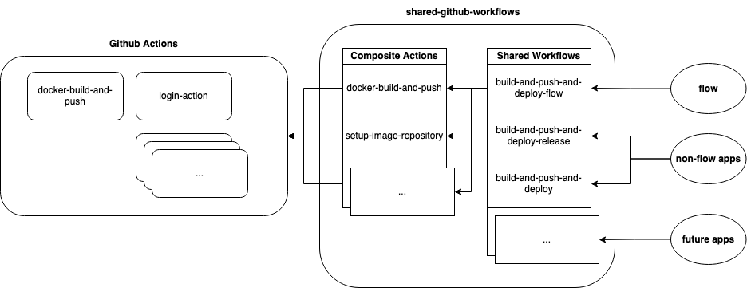

# shared-github-workflows
Reusable GitHub Actions workflows and composite actions.

## Index

* [Deploy Workflows](workflows-deploy.md)
  * [DEPRECATED Deploy Workflows](workflows-deploy-DEPRECATED.md)
* [Misc Workflows](workflows-misc.md)
* [Composite Actions](composite-actions.md)

## How to Use

Repos which would like to be automatically built should call one of the relevant Workflow files in this repo. The Workflow files in this repo are set up to reference different Composite Actions which provide packaged functionality and abstract away some of the complexities of managing the backends of builds.

Details about Workflows, Composite Actions, and how to use each are included in the related documentation.

